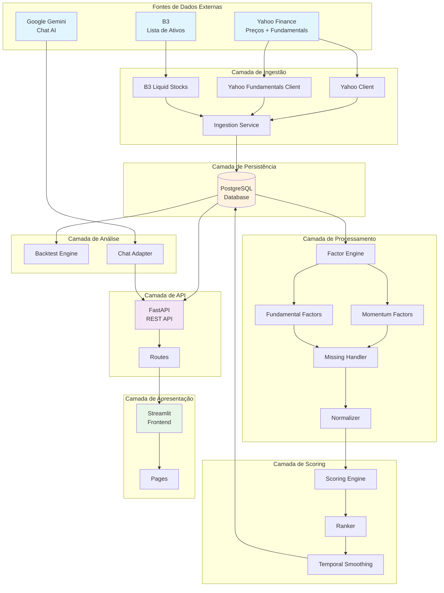
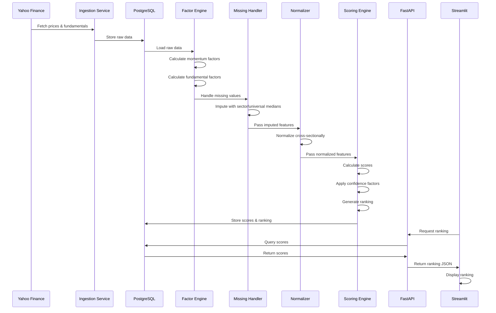
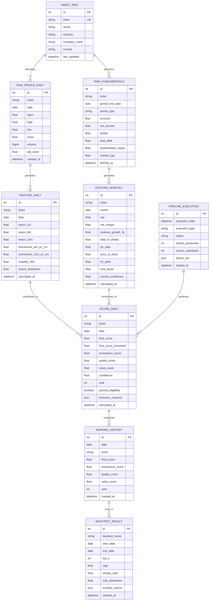
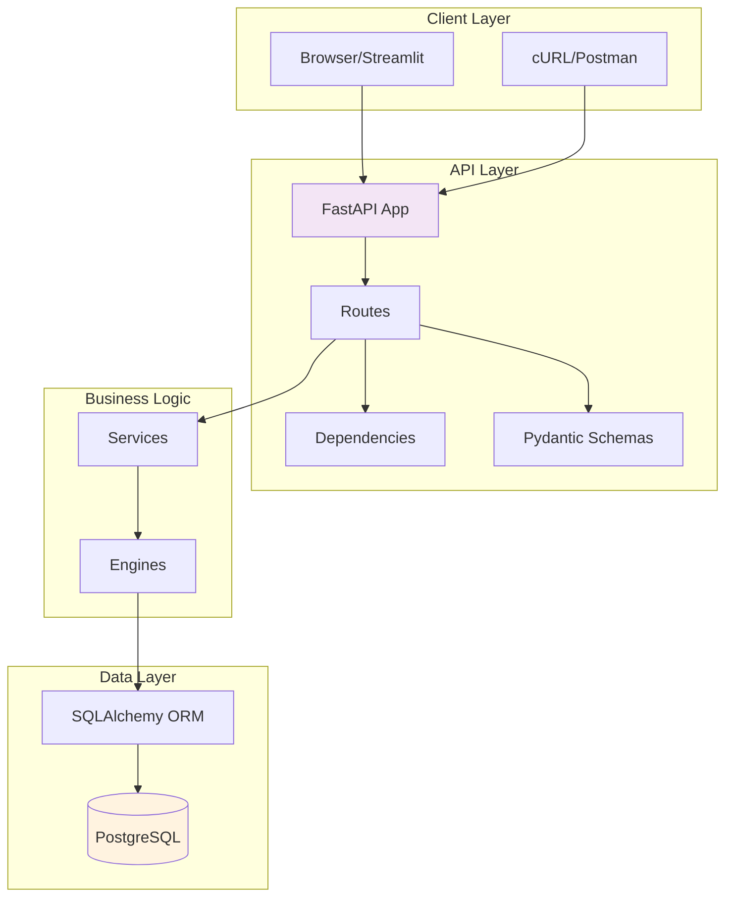
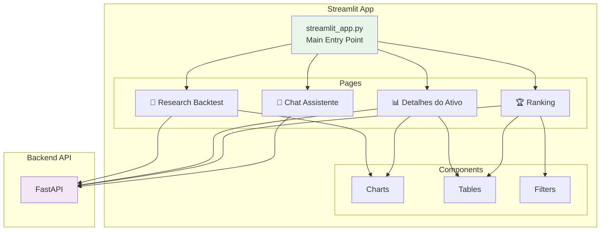
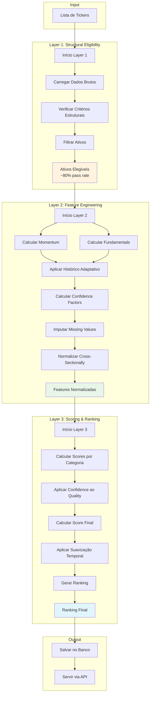
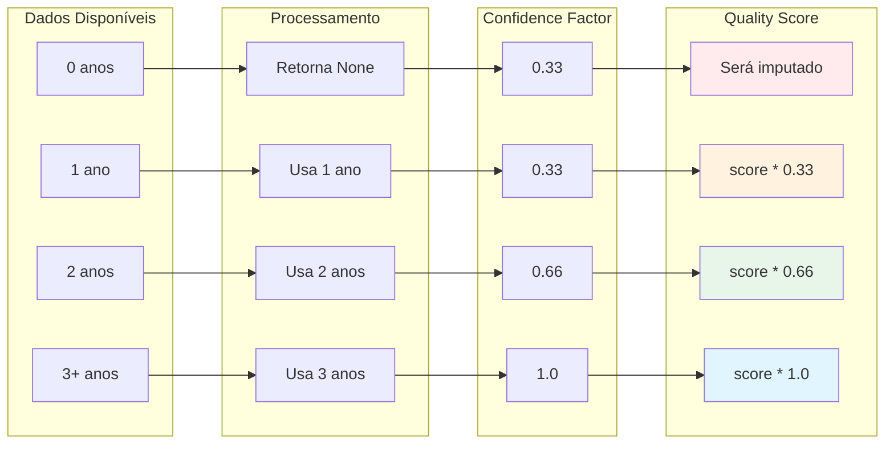
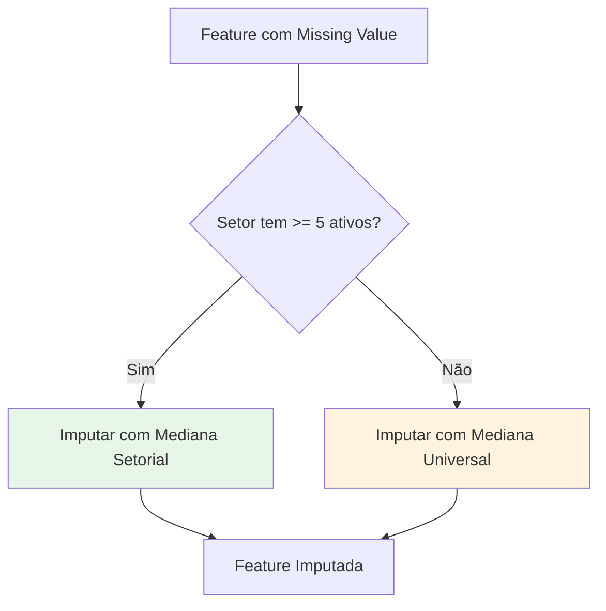
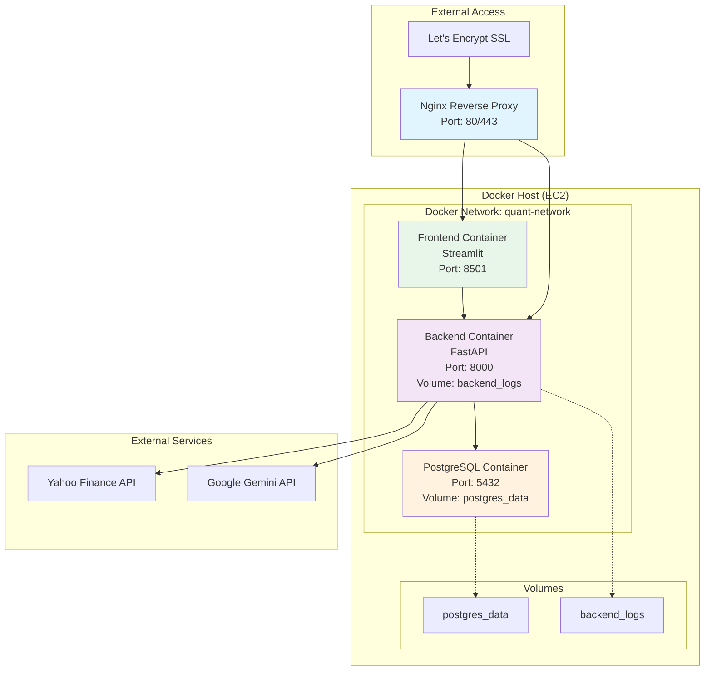

# Arquitetura Completa - Quant Stock Ranker v2.6.0

**Última atualização:** 2026-03-02  
**Versão:** v2.6.0  
**Autor:** Edipo Santos

---

## 📋 Índice

1. [Visão Geral](#visão-geral)
2. [Arquitetura de Alto Nível](#arquitetura-de-alto-nível)
3. [Componentes Principais](#componentes-principais)
4. [Fluxo de Dados](#fluxo-de-dados)
5. [Arquitetura do Pipeline](#arquitetura-do-pipeline)
6. [Modelo de Dados](#modelo-de-dados)
7. [API REST](#api-rest)
8. [Frontend](#frontend)
9. [Deployment](#deployment)
10. [Segurança e Performance](#segurança-e-performance)

---

## 🎯 Visão Geral

O **Quant Stock Ranker** é um sistema de ranking quantitativo de ações brasileiras que combina análise fundamental e técnica usando fatores acadêmicos (Momentum, Quality, Value, Size) com histórico adaptativo.

### Características Principais

- ✅ **Histórico Adaptativo (v2.6.0)**: Usa 1-3 anos de dados sem exigir exatamente 3 anos
- ✅ **Confidence Factors**: Rastreia qualidade dos dados e aplica ao quality_score
- ✅ **Arquitetura de 3 Camadas**: Elegibilidade → Feature Engineering → Scoring
- ✅ **Tratamento Estatístico de Missing Values**: Imputação com medianas setoriais/universais
- ✅ **Pipeline Determinístico**: Mesmos inputs = mesmos outputs
- ✅ **Taxa de Elegibilidade**: ≥80% dos ativos passam filtro estrutural

### Stack Tecnológica

- **Backend**: Python 3.11, FastAPI, SQLAlchemy
- **Frontend**: Streamlit
- **Banco de Dados**: PostgreSQL 15
- **Containerização**: Docker, Docker Compose
- **APIs Externas**: Yahoo Finance, Google Gemini
- **Deploy**: AWS EC2, Nginx

---

## 🏗️ Arquitetura de Alto Nível





---

## 🧩 Componentes Principais

### 1. Backend (FastAPI)

**Responsabilidades:**
- Servir API REST para rankings, detalhes de ativos e histórico de preços
- Gerenciar sessões de chat com Google Gemini
- Health checks e tratamento de erros
- Validação de requests/responses com Pydantic

**Endpoints Principais:**
- `GET /api/v1/ranking` - Ranking completo
- `GET /api/v1/asset/{ticker}` - Detalhes do ativo
- `GET /api/v1/top?n=10` - Top N ativos
- `GET /api/v1/prices/{ticker}` - Histórico de preços
- `POST /api/v1/chat/message` - Chat com Gemini

**Arquivos:**
- `app/main.py` - Entry point da aplicação
- `app/api/routes.py` - Definição de endpoints
- `app/api/schemas.py` - Modelos Pydantic
- `app/api/dependencies.py` - Gerenciamento de sessões DB

### 2. Frontend (Streamlit)

**Responsabilidades:**
- Dashboard interativo com visualização de rankings
- Páginas de detalhes de ativos com gráficos
- Interface de backtest e pesquisa
- Chat assistente integrado

**Páginas:**
- `🏆 Ranking` - Tabela de ranking com filtros
- `📊 Detalhes do Ativo` - Breakdown de scores e gráficos
- `🔬 Research Backtest` - Interface de backtest
- `💬 Chat Assistente` - Conversação com Gemini

**Arquivos:**
- `frontend/streamlit_app.py` - Entry point
- `frontend/pages/*.py` - Páginas individuais

### 3. Data Ingestion Layer

**Responsabilidades:**
- Buscar dados de preços diários do Yahoo Finance
- Buscar demonstrações financeiras do Yahoo Finance
- Obter lista de ativos mais líquidos da B3
- Classificar ativos por setor/indústria

**Componentes:**
- `YahooFinanceClient` - Preços diários (OHLCV)
- `YahooFinanceClient` (fundamentals) - Demonstrações financeiras
- `B3LiquidStocks` - Lista de ativos líquidos
- `AssetInfoService` - Classificação setorial

**Arquivos:**
- `app/ingestion/ingestion_service.py` - Orquestração
- `app/ingestion/yahoo_client.py` - Cliente de preços
- `app/ingestion/yahoo_finance_client.py` - Cliente de fundamentals
- `app/ingestion/b3_liquid_stocks.py` - Ativos B3


### 4. Factor Engine

**Responsabilidades:**
- Calcular fatores de momentum (6m/12m returns, volatility, drawdown)
- Calcular fatores fundamentalistas (ROE, margins, growth, debt ratios)
- Aplicar histórico adaptativo (1-3 anos disponíveis)
- Calcular confidence factors (0.33-1.0)
- Imputar missing values com medianas setoriais/universais
- Normalizar fatores cross-sectionally com winsorização

**Fatores Calculados:**

**Momentum (35%):**
- `momentum_6m_ex_1m` - Retorno 6 meses excluindo último mês
- `momentum_12m_ex_1m` - Retorno 12 meses excluindo último mês
- `volatility_90d` - Volatilidade 90 dias (invertido)
- `recent_drawdown` - Drawdown recente (invertido)

**Quality (25%):**
- `roe_mean_3y` - ROE médio (1-3 anos disponíveis)
- `roe_volatility` - Volatilidade do ROE (invertido)
- `net_margin` - Margem líquida
- `revenue_growth_3y` - Crescimento de receita (1-3 anos)
- `debt_to_ebitda` - Dívida/EBITDA (invertido)

**Value (30%):**
- `pe_ratio` - P/L (invertido)
- `price_to_book` - P/B (invertido)
- `ev_ebitda` - EV/EBITDA (invertido)
- `fcf_yield` - FCF Yield

**Size (10%):**
- `size_factor` - -log(market_cap)

**Arquivos:**
- `app/factor_engine/momentum_factors.py` - Fatores de momentum
- `app/factor_engine/fundamental_factors.py` - Fatores fundamentalistas
- `app/factor_engine/financial_factors.py` - Fatores para bancos
- `app/factor_engine/missing_handler.py` - Imputação de missing values
- `app/factor_engine/normalizer.py` - Normalização cross-sectional
- `app/factor_engine/feature_service.py` - Persistência de features

### 5. Scoring Engine

**Responsabilidades:**
- Combinar fatores normalizados em scores por categoria
- Aplicar confidence factors ao quality_score
- Calcular score final ponderado
- Aplicar suavização temporal (EMA)
- Gerar ranking

**Fórmula do Score Final:**
```
final_score = (momentum_weight * momentum_score +
               quality_weight * quality_score * confidence +
               value_weight * value_score +
               size_weight * size_score)
```

**Suavização Temporal:**
```
final_score_smoothed = 0.7 * final_score_current + 0.3 * final_score_previous
```

**Arquivos:**
- `app/scoring/scoring_engine.py` - Cálculo de scores
- `app/scoring/ranker.py` - Geração de ranking
- `app/scoring/score_service.py` - Persistência de scores
- `app/scoring/temporal_smoothing.py` - Suavização EMA


### 6. Eligibility Filter

**Responsabilidades:**
- Filtrar ativos com problemas estruturais graves
- Nunca excluir por ausência de fatores derivados
- Manter taxa de elegibilidade ≥80%

**Critérios de Exclusão:**
- Patrimônio líquido ≤ 0
- EBITDA ≤ 0 (exceto bancos)
- Receita ≤ 0
- Volume médio < 100k
- Lucro líquido negativo (último ano)
- Lucro negativo em 2 dos últimos 3 anos
- Dívida líquida/EBITDA > 8

**Arquivos:**
- `app/filters/eligibility_filter.py` - Filtro de elegibilidade

### 7. Backtest Engine

**Responsabilidades:**
- Criar snapshots mensais do ranking
- Construir portfólios (equal-weight ou score-weighted)
- Calcular retornos mensais
- Calcular métricas de performance (CAGR, Sharpe, Max Drawdown)
- Persistir resultados de backtest

**Métricas Calculadas:**
- CAGR (Compound Annual Growth Rate)
- Volatilidade anualizada
- Sharpe Ratio
- Sortino Ratio
- Maximum Drawdown
- Average Turnover

**Arquivos:**
- `app/backtest/backtest_engine.py` - Engine principal
- `app/backtest/portfolio.py` - Construção de portfólio
- `app/backtest/metrics.py` - Cálculo de métricas
- `app/backtest/service.py` - Orquestração
- `app/backtest/repository.py` - Persistência

---

## 🔄 Fluxo de Dados

### Fluxo Completo do Pipeline




### Fluxo Detalhado por Camada

```mermaid
graph LR
    subgraph "Layer 1: Structural Eligibility"
        RAW[Raw Data] --> EF[Eligibility Filter]
        EF --> ELIGIBLE[Eligible Tickers<br/>~80% pass rate]
    end
    
    subgraph "Layer 2: Feature Engineering"
        ELIGIBLE --> MOM[Momentum Factors]
        ELIGIBLE --> FUND[Fundamental Factors]
        MOM --> ADAPT[Adaptive History<br/>1-3 years]
        FUND --> ADAPT
        ADAPT --> CONF[Confidence Factors<br/>0.33-1.0]
        CONF --> IMP[Missing Value<br/>Imputation]
        IMP --> NORM2[Cross-Sectional<br/>Normalization]
    end
    
    subgraph "Layer 3: Scoring & Ranking"
        NORM2 --> SCORE[Score Calculation]
        SCORE --> CONFAPP[Apply Confidence<br/>to Quality Score]
        CONFAPP --> FINAL[Final Score]
        FINAL --> SMOOTH[Temporal<br/>Smoothing]
        SMOOTH --> RANK2[Ranking]
    end
    
    style RAW fill:#ffebee
    style ELIGIBLE fill:#fff3e0
    style NORM2 fill:#e8f5e9
    style RANK2 fill:#e1f5ff
```



---

## 🗄️ Modelo de Dados

### Diagrama Entidade-Relacionamento




### Descrição das Tabelas

#### 1. raw_prices_daily
Armazena dados brutos de preços diários (OHLCV) do Yahoo Finance.
- **Unique Constraint**: (ticker, date)
- **Índices**: ticker, date, (ticker, date)

#### 2. raw_fundamentals
Armazena demonstrações financeiras anuais/trimestrais.
- **Unique Constraint**: (ticker, period_end_date, period_type)
- **Índices**: ticker, period_end_date, (ticker, period_end_date)

#### 3. asset_info
Metadados dos ativos (setor, indústria, país).
- **Unique Constraint**: ticker
- **Índices**: ticker

#### 4. features_daily
Fatores de momentum normalizados calculados diariamente.
- **Unique Constraint**: (ticker, date)
- **Índices**: ticker, date, (ticker, date)

#### 5. features_monthly
Fatores fundamentalistas normalizados + confidence factors.
- **Unique Constraint**: (ticker, month)
- **Índices**: ticker, month, (ticker, month)
- **Confidence Columns**: roe_mean_3y_confidence, roe_volatility_confidence, revenue_growth_3y_confidence, net_income_volatility_confidence, overall_confidence

#### 6. scores_daily
Scores finais e rankings diários.
- **Unique Constraint**: (ticker, date)
- **Índices**: ticker, date, (date, final_score), (ticker, date)

#### 7. ranking_history
Snapshots mensais do ranking para backtest.
- **Unique Constraint**: (date, ticker)
- **Índices**: date, (date, rank)

#### 8. backtest_results
Resultados de backtests com métricas de performance.
- **Índices**: (backtest_name, start_date, end_date)

#### 9. pipeline_executions
Rastreamento de execuções do pipeline.
- **Índices**: (execution_date, status), execution_type

---

## 🌐 API REST

### Arquitetura da API




### Endpoints Detalhados

#### GET /api/v1/ranking
Retorna ranking completo ordenado por score final.

**Query Parameters:**
- `date` (optional): Data do ranking (YYYY-MM-DD). Default: data mais recente.

**Response:**
```json
{
  "date": "2026-03-02",
  "rankings": [
    {
      "ticker": "PETR4",
      "final_score": 1.234,
      "momentum_score": 0.567,
      "quality_score": 0.890,
      "value_score": -0.123,
      "confidence": 1.0,
      "rank": 1,
      "passed_eligibility": true
    }
  ],
  "total_assets": 50
}
```

#### GET /api/v1/asset/{ticker}
Retorna detalhes completos de um ativo.

**Path Parameters:**
- `ticker`: Símbolo do ativo (ex: PETR4)

**Query Parameters:**
- `date` (optional): Data do score. Default: data mais recente.

**Response:**
```json
{
  "ticker": "PETR4",
  "score": {
    "final_score": 1.234,
    "momentum_score": 0.567,
    "quality_score": 0.890,
    "value_score": -0.123,
    "confidence": 1.0,
    "rank": 1
  },
  "explanation": "PETR4 apresenta momentum forte...",
  "raw_factors": {
    "momentum_6m_ex_1m": 0.15,
    "roe_mean_3y": 0.25,
    "pe_ratio": 8.5
  }
}
```

#### GET /api/v1/top
Retorna top N ativos por score.

**Query Parameters:**
- `n` (optional): Número de ativos (1-100). Default: 10.
- `date` (optional): Data do ranking. Default: data mais recente.

**Response:**
```json
{
  "date": "2026-03-02",
  "top_assets": [...],
  "n": 10
}
```

#### GET /api/v1/prices/{ticker}
Retorna histórico de preços diários.

**Path Parameters:**
- `ticker`: Símbolo do ativo

**Query Parameters:**
- `days` (optional): Número de dias de histórico (1-3650). Default: 365.

**Response:**
```json
{
  "ticker": "PETR4",
  "start_date": "2025-03-02",
  "end_date": "2026-03-02",
  "count": 252,
  "prices": [
    {
      "date": "2026-03-02",
      "open": 30.50,
      "high": 31.00,
      "low": 30.00,
      "close": 30.75,
      "volume": 15000000,
      "adj_close": 30.75
    }
  ]
}
```

#### POST /api/v1/chat/message
Envia mensagem para o assistente de chat.

**Query Parameters:**
- `message`: Mensagem do usuário
- `session_id` (optional): ID da sessão. Default: "default"
- `gemini_api_key`: API key do Google Gemini

**Response:**
```json
{
  "session_id": "default",
  "message": "Qual o melhor ativo?",
  "response": "Com base no ranking atual...",
  "timestamp": "2026-03-02T10:30:00"
}
```

### Tratamento de Erros

A API usa exception handlers customizados:

- **404 Not Found**: Ticker ou data não encontrados
- **422 Unprocessable Entity**: Validação de parâmetros falhou
- **500 Internal Server Error**: Erro interno do servidor

**Exemplo de Erro:**
```json
{
  "detail": "Ticker INVALID não encontrado para a data 2026-03-02"
}
```

---

## 🎨 Frontend

### Arquitetura do Frontend




### Páginas do Frontend

#### 1. 🏆 Ranking
- Tabela interativa com todos os ativos ranqueados
- Filtros por setor, score mínimo
- Ordenação por qualquer coluna
- Exportação para CSV
- Atualização em tempo real

#### 2. 📊 Detalhes do Ativo
- Seleção de ticker via dropdown
- Breakdown de scores por categoria
- Gráfico de preços históricos
- Fatores brutos normalizados
- Explicação automática gerada

#### 3. 🔬 Research Backtest
- Configuração de parâmetros de backtest
- Seleção de período
- Escolha de estratégia (equal-weight, score-weighted)
- Visualização de métricas de performance
- Gráfico de equity curve

#### 4. 💬 Chat Assistente
- Interface de chat com Google Gemini
- Contexto do sistema de ranking
- Análise conversacional de ativos
- Comparações e recomendações
- Histórico de conversas

---

## 🏗️ Arquitetura do Pipeline

### Pipeline de 3 Camadas




### Modos de Execução do Pipeline

#### FULL Mode
- Busca histórico completo (400 dias de preços)
- Recalcula todos os fatores do zero
- Usado na primeira execução ou quando dados > 7 dias desatualizados
- Tempo: ~15 minutos para 50 ativos

#### INCREMENTAL Mode
- Busca apenas últimos 7 dias
- Atualiza apenas dados recentes
- Usado para atualizações diárias
- Tempo: ~2 minutos para 50 ativos

#### TEST Mode
- Processa apenas 10 ativos
- Usado para validação e testes
- Tempo: ~12 segundos

#### LIQUID Mode
- Processa 50 ativos mais líquidos da B3
- Modo de produção padrão
- Tempo: varia conforme FULL ou INCREMENTAL

### Histórico Adaptativo (v2.6.0)



### Tratamento de Missing Values



---

## 🚀 Deployment

### Arquitetura de Deployment (Docker)




### Docker Compose Services

#### PostgreSQL (Database)
- **Image**: postgres:15-alpine
- **Container Name**: quant-ranker-db
- **Port**: 5432
- **Volume**: postgres_data (persistent)
- **Health Check**: pg_isready
- **Restart Policy**: unless-stopped

#### Backend (FastAPI)
- **Build**: docker/Dockerfile.backend
- **Container Name**: quant-ranker-backend
- **Port**: 8000
- **Volumes**: 
  - ./app:/app/app (code)
  - ./scripts:/app/scripts (scripts)
  - backend_logs:/app/logs (logs)
- **Depends On**: postgres (healthy)
- **Health Check**: curl http://localhost:8000/health
- **Restart Policy**: unless-stopped

#### Frontend (Streamlit)
- **Build**: docker/Dockerfile.frontend
- **Container Name**: quant-ranker-frontend
- **Port**: 8501
- **Volumes**:
  - ./frontend:/app/frontend (code)
  - ./app:/app/app (shared models)
- **Depends On**: backend (healthy), postgres (healthy)
- **Health Check**: curl http://localhost:8501/_stcore/health
- **Restart Policy**: unless-stopped

### Configuração de Rede

- **Network**: quant-network (bridge)
- **DNS**: 8.8.8.8, 8.8.4.4
- **Isolation**: Containers se comunicam apenas via network interna

### Automação com Cron

```bash
# Pipeline diário às 19:00 (após fechamento do mercado)
0 19 * * 1-5 cd ~/quant_stock_rank && docker exec quant-ranker-backend python scripts/run_pipeline_docker.py --mode liquid --limit 50 >> ~/logs/pipeline.log 2>&1

# Suavização temporal às 19:30
30 19 * * 1-5 cd ~/quant_stock_rank && docker exec quant-ranker-backend python scripts/apply_temporal_smoothing.py --all >> ~/logs/smoothing.log 2>&1

# Backup diário do banco às 23:00
0 23 * * * mkdir -p ~/backups && docker exec quant-ranker-db pg_dump -U quant_user quant_ranker | gzip > ~/backups/backup_$(date +\%Y\%m\%d_\%H\%M\%S).sql.gz 2>> ~/logs/backup.log

# Limpeza de backups antigos (manter últimos 7) - domingo às 2h
0 2 * * 0 cd ~/backups && ls -t backup_*.sql.gz | tail -n +8 | xargs rm -f 2>> ~/logs/cleanup.log
```

---

## 🔒 Segurança e Performance

### Segurança

#### Firewall (UFW)
```bash
# Permitir apenas portas necessárias
sudo ufw allow 22/tcp   # SSH
sudo ufw allow 80/tcp   # HTTP
sudo ufw allow 443/tcp  # HTTPS
sudo ufw enable
```

#### Fail2ban
- Proteção contra brute force em SSH
- Ban automático após 3 tentativas falhadas
- Ban duration: 1 hora

#### SSL/HTTPS
- Let's Encrypt para certificados gratuitos
- Renovação automática via Certbot
- Redirect HTTP → HTTPS

#### Senhas
- PostgreSQL: senha forte (mínimo 16 caracteres)
- API Keys: armazenadas em variáveis de ambiente
- Chave SSH: permissões 400

#### Atualizações
- Unattended-upgrades para patches de segurança
- Docker images atualizadas regularmente

### Performance

#### Database Optimization
```sql
-- Índices otimizados
CREATE INDEX idx_ticker_date ON raw_prices_daily(ticker, date);
CREATE INDEX idx_date_score ON scores_daily(date, final_score);

-- Vacuum e analyze periódicos
VACUUM ANALYZE;
```

#### API Caching
- Responses cacheadas para queries frequentes
- TTL configurável por endpoint
- Cache invalidation em updates

#### Rate Limiting
- Yahoo Finance: 2s entre requisições
- Batches de 10 ativos
- Retry com backoff exponencial

#### Resource Limits
```yaml
# docker-compose.yml
deploy:
  resources:
    limits:
      memory: 1G
      cpus: '1.0'
    reservations:
      memory: 512M
      cpus: '0.5'
```

#### Monitoring
- Docker stats para uso de recursos
- Health checks automáticos
- Logs estruturados
- Alertas via email (opcional)

---

## 📊 Métricas e KPIs

### Métricas do Sistema

| Métrica | Valor Esperado | Descrição |
|---------|----------------|-----------|
| Taxa de Elegibilidade | ≥80% | % de ativos que passam filtro estrutural |
| Score Médio | ~0.00 | Média dos scores finais |
| Score Desvio Padrão | 0.2-0.5 | Dispersão dos scores |
| Score Range | [-3, +3] | Intervalo de scores |
| Pipeline FULL (50 ativos) | ~15 min | Tempo de execução completa |
| Pipeline INCREMENTAL (50 ativos) | ~2 min | Tempo de atualização diária |
| API Response Time | <100ms | Tempo de resposta médio |
| Database Size | ~500MB | Tamanho do banco (50 ativos, 1 ano) |

### Métricas de Qualidade dos Dados

| Métrica | Valor Esperado | Descrição |
|---------|----------------|-----------|
| Confidence Factor Médio | 0.7-1.0 | Qualidade média dos dados |
| Missing Values (pré-imputação) | <20% | % de valores ausentes |
| Missing Values (pós-imputação) | 0% | Após imputação setorial/universal |

